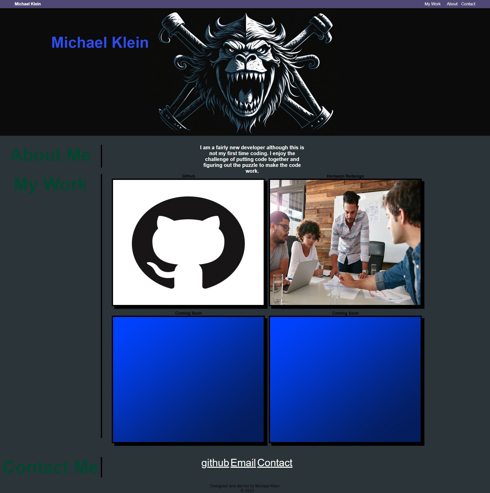

# My Portfolio 

# Description
This project focused on getting a new portfolio up and running from scratch. The tricky part was the use of positioning and responsive design. 

## Installation
to insall this project, clone the repository from [github](https://github.com/b0n3yard/Michael_Klein_Portfolio) and open index.html in the chrome browser. alternatively you can view the finished page [here](https://b0n3yard.github.io/Michael_Klein_Portfolio/)

## Usage

## Credits
Michael Klein

## Licence